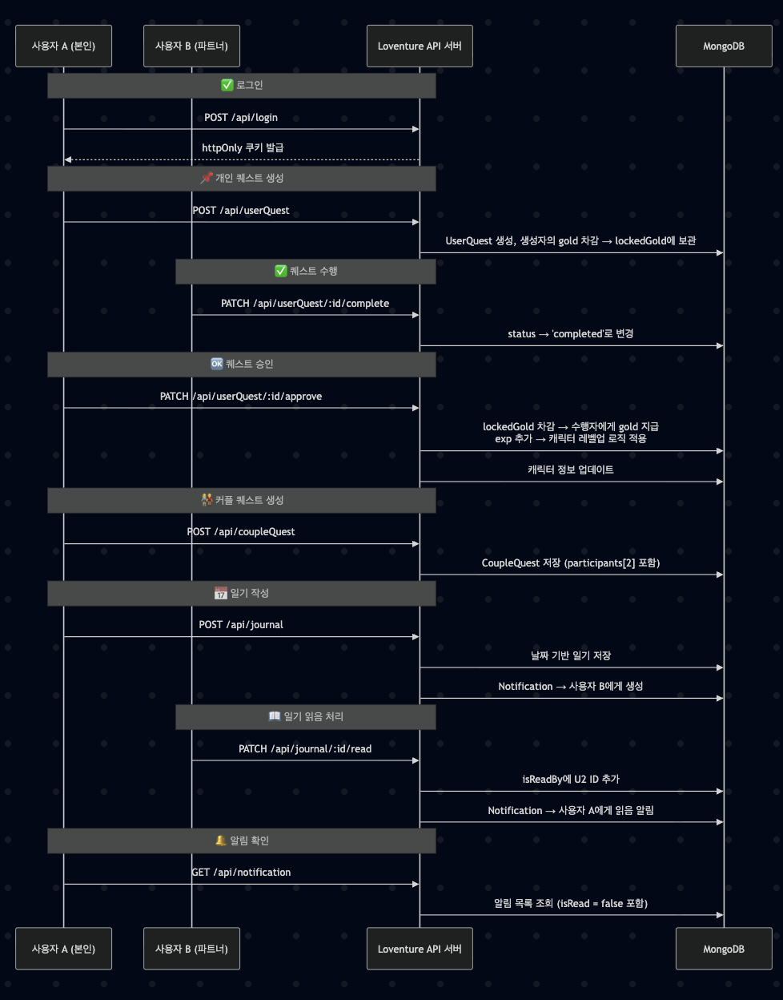
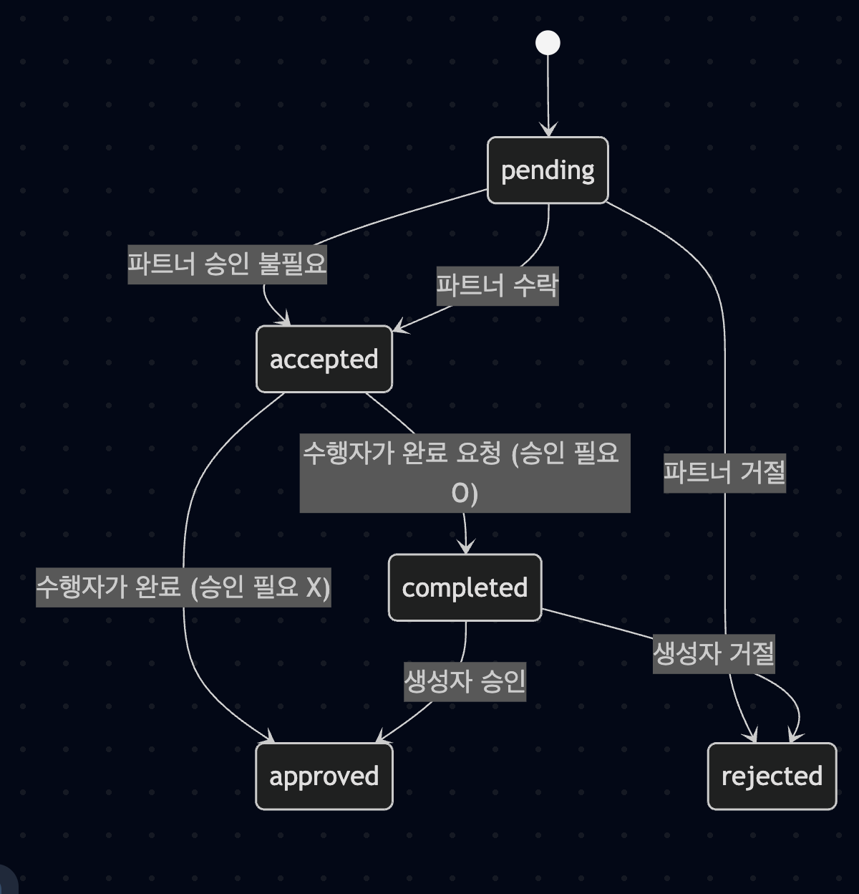
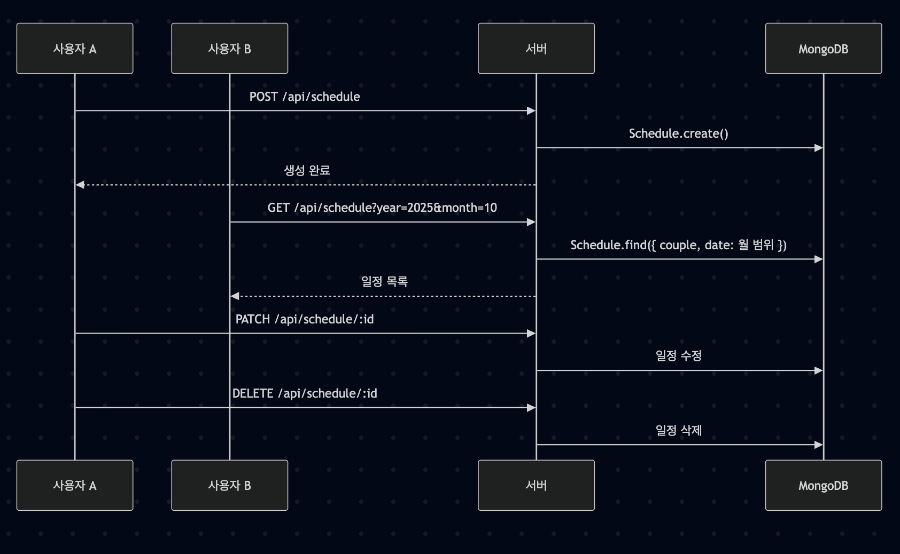

# 💞 Loventure: 커플 기반 일정 & 교환일기 웹 애플리케이션

**Loventure**는 커플을 위한 RPG 스타일의 일정 관리 및 감성 일기 교환 플랫폼입니다. 각자 캐릭터를 육성하며, 함께 퀘스트를 수행하고, 교환일기로 감정을 나눌 수 있는 특별한 공간을 제공합니다.

## ✨ 주요 기능

### 📜 퀘스트 시스템
- **개인 퀘스트**: 사용자가 직접 설정한 목표 수행 (예: "하루 10분 산책하기").
- **커플 퀘스트**: 서로 협동해서 수행하는 목표 (예: "둘 다 일찍 자기").
- **경험치 / 골드 보상**: 퀘스트 생성 시 자동 설정

### 📅 일정 시스템
- 개인 일정 및 파트너의 일정 공유
- 스티커를 활용한 시각적 피드백 제공
- 감성적, 직관적 일정 표시로 커플 사용자 UX 향상


### 📖 교환일기 시스템
- 감정과 하루를 공유하는 **서로 주고받는 일기 형식**.
- 날짜별 작성 및 읽음 여부 확인 가능.
- 이모지 기반 날씨 기록 기능.
- 상대방의 읽음 상태를 확인하고, 알림으로 전달.

### 👤 캐릭터 성장
- 퀘스트 보상으로 캐릭터가 성장하며 **진화** 가능.

### 🔔 알림 시스템
- 교환일기 작성/읽음, 퀘스트 생성/완료 등 상황별 실시간 알림 제공.
- 읽지 않은 알림 수를 효율적으로 관리 (백엔드 처리).

### 📱 UI
- 모바일 환경에서 구성된 컴포넌트 렌더링.
- 따뜻한 파스텔 톤, 미니멀 UI 지향.

---

## 🛠️ 기술 스택

| 구분 | 사용 기술 |
|------|-----------|
| 프론트엔드 | Next.js 15 (App Router), TypeScript, TailwindCSS |
| 백엔드 | Node.js, Express-style API Routes, Mongoose (MongoDB ODM) |
| 인증/보안 | httpOnly Cookie 기반 세션 인증 |
| 배포 | AWS EC2 (Ubuntu), PM2, |
| 기타 | Figma (디자인), ESLint / Prettier (코드 스타일) |

---

## 📁 주요 폴더 구조
```bash
Loventure/
├── app/
│   ├── api/
│   │   ├── userQuest/           # 개인 퀘스트 API
│   │   ├── coupleQuest/         # 커플 퀘스트 API
│   │   ├── journal/             # 교환일기 API
│   │   ├── schedule/            # 일정 API
│   │   ├── diary/               # 공유일기 API
│   │   ├── character/           # 캐릭터 API
│   │   ├── user/                # 로그인 관련 API
│   │   ├── couple/              # 커플 관련 API (생성, 연결 ...)
│   │   └── notification/        # 알림 관련 API
│   └── (route pages...)         # Next.js 페이지 라우트 (예: /quest, /diary 등)
│
├── components/
│   ├── Calendar/                # 날짜 선택 및 일정 UI
│   ├── Quest/                   # 퀘스트 관련 컴포넌트 (리스트/모달 등)
│   ├── Character/               # 캐릭터 정보 및 커스터마이징
│   ├── Notification/            # 알림 UI 컴포넌트
│   └── (공통 UI 컴포넌트 등)  
│
├── lib/                         # 유틸리티 및 인증 관련 로직
│   ├── auth.ts                  # 사용자 인증 로직 (getAuthenticatedUser 등)
│   ├── mongodb.ts               # DB연결
│   └── notify.ts                # 알림
│
├── utils/                              # 유틸리티 
│   ├── checkLevelUp.ts                 # 캐릭터 레벨업 및 진화
│   ├── generateCode.ts                 # 커플 코드 생성
│   ├── generateUniqueCoupleCode.ts     # 코드 생성 시 중복 방지
│   ├── getPartnerId.ts                 # 파트너 ID 획득
│   ├── random.ts                       # 등록 시 캐릭터 랜덤 생성
│   ├── response.ts                     # API 응답
│   └── rewardCalculator.ts             # 퀘스트 보상 설정
│
├── models/                      # Mongoose 모델 정의
│   ├── User.ts
│   ├── Couple.ts
│   ├── UserQuest.ts
│   ├── CoupleQuest.ts
│   ├── Character.ts
│   ├── ExchangeJournal.ts
│   ├── Schedule.ts
│   └── Notification.ts
│
├── public/                      # 정적 파일 (이미지, 스프라이트 등)
│
├── styles/                      # 전역 스타일 설정 (Tailwind 등)
│
├── .env.local                   # 환경 변수 파일 (로컬)
├── next.config.js               # Next.js 설정 파일
├── package.json
└── README.md
```

---

## 🧑‍💻 개발자

| 이름 | 역할 |
|------|------|
| 이동은 (@highblueberry)|  |
| 최상훈 (@shun010116) | 백엔드 설계 및 개발 |

---

## 📌 프로젝트 목적

> 바쁜 일상 속에서도 서로의 하루를 나누고, 함께 성장하는 경험을 제공하고자 시작된 커플 지향 웹앱입니다. 단순한 스케줄러가 아닌, **게임처럼 즐기며 관계를 돌볼 수 있는 플랫폼**을 목표로 합니다.

---

## 📎 라이선스

MIT License

## API 흐름도


주요 API
<details>
    <summary>userQuest</summary>

✅ 상태 목록

| 상태(status) | 설명 |
| ----- | ----- |
| pending | 퀘스트가 처음 생성된 상태 |
| accepted | 파트너가 수락한 상태 or 승인 없이 바로 활성화된 상태 |
| rejected | 퀘스트 요청이 수락되지 않은 상태 |
| completed | 퀘스트 수행자가 완료 요청을 보낸 상태
| approved | 생성자가 수행 완료를 승인한 상태 -> 보상 지급 완료 |

📘 상태 전이 흐름


🧠 상세 흐름 설명
1. pending 상태
    - 퀘스트 생성 직후 상태
    - needrApproval: boolean에 따라 분기
    - 승인 불필요 (needApproval = false)
        - --> status = accepted
    - 승인 필요 (needApproval = true)
        - 파트너가 수락 --> status = accepted
        - 파트너가 거절 --> status = rejected
2. accepted 상태
    - 퀘스트가 정식으로 활성화
    - 수행자는 완료 버튼을 누를 수 있음
    - 승인 불필요 (needApproval = false)
        - 완료 버튼 누르면 status = approved, 보상지급
    - 승인 필요 (needApproval = true)
        - 완료 버튼 누르면 status = complted  
3. completed 상태
    - 퀘스트 수행 완료 후 생성자의 최종 승인을 기다림
    - 생성자가 승인 --> status = approved
    - 보상 지급 및 캐릭터 경험치 반영
    - 생성자가 거절 --> status = rejected
4. approved 상태
    - 퀘스트 종료 및 보상 지급 완료
    - 캐릭터 성장 반영 (applyLevelUP() 호출 가능)
5. rejected 상태
    - 파트너 혹은 생성자가 퀘스트를 거절한 경우

</details>

<details>
    <summary>journal</summary>

📘 기능 흐름


🧠 흐름 정리 요약
| 단계 | 사용자 | 행동 | 상태 |
| ----- | ----- | ----- | ----- |
| 1 | 작성자 | /api/journal로 일기 작성 | DB에 저장 + 상대에게 알림 |
| 2 | 상대 | 캘린더에서 일기 조회 | /api/journal?date=... |
| 3 | 상대 | 처음 읽을 경우 /api/journal/:id/read | isReadBy에 추가 |
| 4 | 작성자 | 알림 확인 | 상대가 일기를 읽었는지 확인 가능 |


</details>

<details>
    <summary>schedule</summary>

📘 기능 흐름


🧠 설계 포인트
| 항목 | 설명 |
| ----- | ----- |
| 커플 단위 | 같은 커플이면 상대방도 볼 수 있음 |
| 권한 제한 | 수정/삭제는 작성자만 가능 |

</details>

---

## 🧙 캐릭터 레벨 시스템 (Level System)

🎯 목적
- 퀘스트 수행 --> 보상으로 경험치(exp) 획득 -> 캐릭터 level 증가
- 캐릭터 성장의 동기 부여 및 시각적 진화(변화) 요소 제공
- 향후 커스터마이징/아이텤 해금 조건으로 활용 가능성

<details>
    <summary>현재 적용 규칙</summary>

| 항목 | 값 |
| ----- | ----- |
| 최대 레벨 | 50 |
| 진화 레벨 | 20 |

다음 경험치
%20with%20Evolution%20at%20Lv20.png)

누적 경험치
%20with%20Evolution%20at%20Lv20.png)

[경험치 테이블](./public/Loventure_Leveling_Simulation_with_Evolution_at_Lv20__Lv1_50_.csv)
</details>