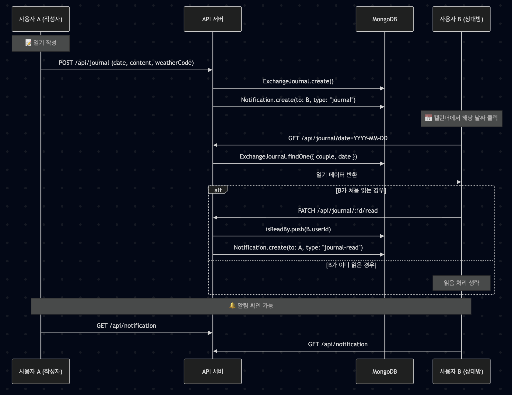

# 💞 Loventure: 커플 기반 일정 & 교환일기 웹 애플리케이션

**Loventure**는 커플을 위한 RPG 스타일의 일정 관리 및 감성 일기 교환 플랫폼입니다.      
기존의 커플 앱들은 사용자의 모든 요구를 맞춰주지 못합니다. 일정 공유 달력이나 교환일기같은 소소한 일상을 나눌 수 있는 기능이 부족합니다.    
**Loventure**에서는 커플이 각자 캐릭터를 육성하며, 함께 퀘스트를 수행하고, 교환일기로 감정을 나눌 수 있는 특별한 공간을 제공합니다.    

## ✨ 주요 기능

### 📜 퀘스트 시스템
- **개인 퀘스트**: 사용자 혹은 내 연인이 설정해주는 목표 수행 (예: "하루 10분 산책하기, 카톡 답장 잘하기").
- **연인 퀘스트**: 서로 협동해서 수행하는 목표 (예: "둘 다 일찍 자기, 여름이 되기전에 여행가기").
- **경험치 / 골드 보상**: 퀘스트 생성 시 자동 설정

### 📅 일정 시스템
- 개인 일정 및 연인의 일정 공유.
- 스티커를 활용해 일정을 시각적으로 제공.
- 감성적, 직관적인 일정 표시로 커플 사용자 UX 향상 및 같이 달력을 꾸미는 느낌을 준다.


### 📖 교환일기 시스템
- 감정과 하루를 공유하는 **서로 주고받는 일기 형식**.
- 날짜별 작성 및 읽음 여부 확인 가능.
- 이모지 기반 날씨 기록 기능.
- 상대방의 읽음 상태를 확인하고, 알림으로 전달.

### 👤 캐릭터 시스템
- 퀘스트 보상으로 캐릭터가 성장하며 **진화** 가능.
- 캐릭터 별로 주기적인 동작이 존재.

### 🔔 알림 시스템
- 교환일기 작성/읽음, 퀘스트 생성/완료 등 상황별 실시간 알림 제공.
- 읽지 않은 알림 수를 효율적으로 관리 (백엔드 처리).

### 📱 UI
- 모바일 환경에서 구성된 컴포넌트 렌더링.
- 커플 사이트에 알맞는 따뜻한 파스텔 톤, 미니멀 UI 지향.

---


## 🧙 캐릭터 레벨 시스템 (Level System)

⚙️ 기능
- 퀘스트 달성 --> 보상으로 경험치(exp) 획득 -> 캐릭터 level 증가
- 일정 level 달성시 캐릭터의 시각적 진화(변화) 요소 제공합니다.
- 향후 캐릭터 커스터마이징/아이템 해금 조건으로 활용 가능성이 있습니다.  
    
<br><br>      

<div align="center">
  
  <div><em>메인 화면의 캐릭터창</em></div>
</div>

<br>


메인 화면에서는 카드 형태의 공간으로 본인과 연인의 캐릭터가 나뉘어져 있습니다.     
캐릭터 카드에는 다음의 내용이 포함되어 있습니다. 
 <li> 캐릭터의 모습 
 <li> 커플의 애칭
 <li> 레벨과 경험치바
 <li> 오늘의 일정


<br><br>

<div align="center">
  <table>
    <tr>
      <td></td>
      <td></td>
    </tr>
    <tr>
      <td></td>
      <td></td>
    </tr>
  </table>

  <div><em>캐릭터별 동작</em></div>
</div>

<br>

캐릭터의 종류는 2가지 입니다.
- 고양이
- 양

각 캐릭터는 고유한 동작이 있고, LV.20 달성시 다음 단계로 진화합니다.
진화할 때는 캐릭터 외형과 고유 동작이 변화합니다


<br><br>

<details>
    <summary>경험치 적용 규칙</summary>

| 항목 | 값 |
| ----- | ----- |
| 최대 레벨 | 50 |
| 진화 레벨 | 20 |

| 레벨 | 공식 |
| ----- | ----- |
| 1 - 10 | $120 + 40 \times (\textrm{level} -1)$ |
| 11 - 30 | $(\textrm{Cumulative 11}) / 11^{1.5} \times \textrm{level}^{1.5}$ |
| 31 - 50 | $(\textrm{Cumulative 30}) \times 1.05 / 31^{2.0} \times \textrm{level}^{2.0} $ |

다음 경험치
%20with%20Evolution%20at%20Lv20.png)

누적 경험치
%20with%20Evolution%20at%20Lv20.png)

[경험치 테이블](./public/Loventure_Leveling_Simulation_with_Evolution_at_Lv20__Lv1_50_.csv)
</details>


---

### 💎 퀘스트 시스템

--- 

⚙️ 기능
- 사용자 퀘스트와 커플 공동 퀘스트가 존재합니다.
- 사용자 스스로 퀘스트를 생성하거나 연인이 나에게 퀘스트를 줄 수 있습니다.
- 퀘스트를 완료하면 연인과 함께 성장하는 캐릭터를 지켜볼 수 있습니다.
- 제약없는 퀘스트 커스텀으로 사용자별로 자유롭게 퀘스트 생성할 수 있습니다.
- 퀘스트의 성공 여부는 내가 판단할 수도 있지만, 연인이 판단이 필요한 경우가 있습니다.

<br>

<div align="center">
  <table>
    <tr>
      <td></td>
      <td></td>
    </tr>
  </table>
  <div><em>사용자 및 커플 퀘스트 페이지</em></div>
</div>

<br>


퀘스트 페이지는 유저 퀘스트 페이지와 커플 퀘스트 페이지가 있습니다.  
유저 퀘스트 페이지는 사용자의 퀘스트와 연인의 퀘스트를 생성하고 확인하는 페이지입니다.   

커플 퀘스트 페이지는 커플 공동의 퀘스트를 생성하고 확인하는 페이지입니다.

<br>


<div align="center">
  <table>
    <tr>
      <td></td>
      <td></td>
    </tr>
  </table>
  <div><em>연인 및 커플 퀘스트 생성</em></div>
</div>

<br>

십자가 모양의 버튼을 눌러서 나오는 위의 창에서 퀘스트를 생성할 수 있습니다.   
퀘스트는 다음의 구조를 가집니다.
- 제목 - 퀘스트 페이지에 뜨는 퀘스트의 명칭입니다.
- 설명 - 퀘스트에 대한 자세한 설명입니다.
- 목표 유형 - 일회성인지 여러 번 수행할 퀘스트인지 정합니다.
- 목표값 - 여러 번 수행할 퀘스트의 경우 수행할 횟수를 지정합니다.
- 난이도 - 퀘스트의 난이도를 설정합니다.
- 리셋 주기 - 퀘스트 생성 주기입니다. 
- 파트너에게 줄 보상 - 내가 연인에게 퀘스트를 준 경우에 연인이 퀘스트를 완료하면 주는 보상입니다.

<br><br>

<div align="center">
  <table>
    <tr>
      <td></td>
      <td></td>
    </tr>
  </table>
  <div><em>연인이 퀘스트를 주었을 때 1</em></div>

  <br><br>

만약에 자신의 퀘스트를 생성하는 것이 아니라 연인에게 퀘스트를 주는 경우에는    
연인 퀘스트 리스트의 십자가 모양의 버튼을 눌러서 연인에게 줄 퀘스트를 생성할 수 있습니다.    

퀘스트를 생성하면 연인 퀘스트 목록에 빈 하트 모양의 퀘스트가 생성되고, 이는 아직 연인이 수락하지 않았다는 뜻입니다.

  <br>

  <table>
    <tr>
      <td></td>
      <td></td>
    </tr>
  </table>
  <div><em>연인이 퀘스트를 주었을 때 2</em></div>
</div>


<br>

빈 하트의 퀘스트를 연인이 확인하고 수정한 뒤에 수락하면 하트가 채워지고 완전한 퀘스트가 됩니다.


<br><br>


<details>
    <summary>보상 생성 규칙</summary>

- userQuest
  1. 기본 경험치  
  레벨 L일 때의 주간 퀘스트 경험치는:  
  $\textrm{BaseEXP}(L) = \frac{\textrm{expToNextLevel}(L)}{14}$
  1. 보상 경험치 공식  
  입력변수
    - $D$: 퀘스트 난이도 (1-5)
    - $G$: 목표 유형 (check: 1.0, count: 1.15)
    - $R$: 반복 유형 (Daily: 0.9, Weekly, One-time: 1.0)
    - $T$: 목표 수치(주로 count에 해당)
    - $E$: 진화 여부(Lv ≥ 20이면 true)  
  중간 계산
    - 난이도 보정: $\textrm{diffMult}(D)$
    - 목표 유형 가중치: $\textrm{goalWeight}(G)$
    - 반복 유형 가중치: $\textrm{resetMult}(R)$
    - 크기 보정(count만): $\textrm{sizeFactor}(T) = 1 + \log_{10}({T+9})$  

  경험치 공식  
  $$\textrm{rawEXP} = \textrm{BaseEXP}(L) \times \textrm{diffMult}(D) \times \textrm{goalWeight}(G) \times \textrm{resetMult}(R) \times \begin{cases}1, \quad \quad \quad \quad \quad \quad \textrm{if}\;G = \textrm{check}\\ \textrm{sizeFactor}(T),\;\; \textrm{if}\;G=\textrm{count} \end{cases}$$
  $$EXP = \textrm{clamp}(\textrm{round}(\textrm{RawEXP} \times (1.05 \; \textrm{if}\; E)),\; \textrm{max}(20, 0.4 \cdot \textrm{BaseEXP}), 6.0 \cdot \textrm{BaseExp}) $$

  3. 골드 보상 공식
  $\textrm{Gold} = \textrm{round5}(EXP \times 0.6 \times (1.10 \; \textrm{if} \; E)) $
  - round5(n): 5단위 반올림 (e.g., 17 → 15, 18 → 20)

- coupleQuest
  1. 입력 변수
    - $L$: 평균 레벨
    - $G$: 목표 유형 (shared-count: 1.25, both-complete: 1.35)
    - $R$: 반복 유형 (Daily: 0.9, Weekly, One-time: 1.0)
    - $T$: 목표 수치
    - $E$: 진화 여부

  2. 경험치 공식  
  $$\textrm{rawEXP} = \textrm{BaseEXP}(L) \times 1.5 \times \textrm{goalWeight}(G) \times \textrm{resetMult}(R) \times \textrm{sizeFactor}(T)$$
  $$EXP = \textrm{clamp}(\textrm{round}(\textrm{RawEXP} \times (1.05 \; \textrm{if}\; E)),\; \textrm{max}(20, 0.4 \cdot \textrm{BaseEXP}), 6.0 \cdot \textrm{BaseExp}) $$

  3. 골드 공식  
  $\textrm{Gold} = \textrm{round5}(\textrm{EXP} \times 0.6 \times (1.10 \; \textrm{if} \; E))$

요약
| 항목 | 설명 |
| ----- | ----- |
|BaseEXP | 레벨별 주간 기준 퀘스트 보상 경험치 |
| diffMult | 난이도에 따른 경험치 보정값 |
| goalWeight | 목표 유형에 따른 보정값 |
| resetMult | 반복 주기 보정값 |
| sizeFactor | 목표 수치 크기에 따른 보정값 (log10 기반) |
| Evolved | 20 level 이상일 경우, 경험치 1.05배, 골드 1.10배 |

</details>

---

## 🗓️ 일정 공유 달력 시스템

⚙️ 기능
- 미니멀 파스톤 텔의 따뜻한 감성을 주는 달력 디자인
- 서로의 일정이 공유되는 달력으로 커플이 서로의 일정을 쉽게 공유할 수 있습니다..
- 각 일정은 스티커로 표시하여 일정의 직관성을 높이고, 커플이 같이 달력을 꾸미는 재미를 줍니다.
- 금일 일정은 메인 캐릭터 화면에서 리스트형식으로 보여줍니다.

<br><br>

<div align="center">
  
  <div><em>달력 페이지</em></div>
</div>

<br>

달력 페이지에서는 커플이 서로의 일정을 공유할 수 있습니다.   
공유한 일정은 스티커로 표시되어 실제로 달력에 스티커를 붙이듯이 달력을 꾸밀 수 있습니다.    


<br>

<div align="center">
  <table>
    <tr>
      <td></td>
      <td></td>
    </tr>
  </table>
  <div><em>일정 생성</em></div>
</div>

<br>

일정 생성 화면에서 스티커를 선택하고 어떤 일정인지 설명을 적을 수 있습니다.
여기서 생성한 일정 중 금일의 일정은 메인 화면 중 캐릭터 카드에서 리스트 형식으로 보여줍니다.

<br>

<div align="center">
  <table>
    <tr>
      <td></td>
    </tr>
  </table>
  <div><em>메인화면에서 보이는 일정</em></div>
</div>


---

## 💌 교환일기 시스템

⚙️ 기능
- 커플이 주고받을 수 있는 날짜별 교환일기 시스템입니다.
- 상대방이 읽었는지 확인 가능합니다. 상대방이 읽으면 알람이 옵니다. 

<br>

<div align="center">
  <table>
    <tr>
      <td></td>
    </tr>
  </table>
  <div><em>교환일기 화면</em></div>
</div>

<br>

달력화면에서 날짜를 선택하면 다음의 사진처럼 교환일기를 작성하는 페이지로 넘어갑니다.

<br><br>

<div align="center">
  <table>
    <tr>
      <td></td>
      <td colspan="2" align="center"></td>
    </tr>
  </table>
  <div><em>교환일기 작성 및 읽기</em></div>
</div>

<br>

일기에서는 제목, 날씨, 내용을 적을 수 있고 교환일기를 작성한 날짜는 달력화면에 파란색으로 칠해집니다.    
또한 교환일기가 작성된 달력칸을 클릭하면 상대방이 읽었는지 확인이 가능합니다.


<br><br>


## 🛠️ 기술 스택

| 구분 | 사용 기술 |
|------|-----------|
| 프론트엔드 | Next.js 15 (App Router), TypeScript, TailwindCSS |
| 백엔드 | Node.js, Express-style API Routes, Mongoose (MongoDB ODM) |
| 인증/보안 | httpOnly Cookie 기반 세션 인증 |
| 배포 | AWS EC2 (Ubuntu), PM2, |
| 기타 | Figma (디자인), ESLint / Prettier (코드 스타일) |

---

## ⚙️ 서버 환경 구성
| 항목 | 내용 |
| ----- | ----- |
| OS | Ubuntu 22.04 LTS (AWS EC2) |
| 런타임 | Node.js v20.x |
| 프레임워크 | Next.js 15 (App Router) |
| 데이터베이스 | MongoDB Atlas (Cloud) |
| 프로세스 관리  | PM2 |
| 배포 방식 | Git + PM2 Reload |
| 인증 방식 | httpOnly Cookie + JWT |

---

## 📁 주요 폴더 구조
```bash
Loventure/
├── app/
│   ├── api/
│   │   ├── userQuest/           # 개인 퀘스트 API
│   │   ├── coupleQuest/         # 커플 퀘스트 API
│   │   ├── journal/             # 교환일기 API
│   │   ├── schedule/            # 일정 API
│   │   ├── diary/               # 공유일기 API
│   │   ├── character/           # 캐릭터 API
│   │   ├── user/                # 로그인 관련 API
│   │   ├── couple/              # 커플 관련 API (생성, 연결 ...)
│   │   └── notification/        # 알림 관련 API
│   └── (route pages...)         # Next.js 페이지 라우트 (예: /quest, /diary 등)
│
├── components/
│   ├── Calendar/                # 날짜 선택 및 일정 UI
│   ├── Quest/                   # 퀘스트 관련 컴포넌트 (리스트/모달 등)
│   ├── Character/               # 캐릭터 정보 및 커스터마이징
│   ├── Notification/            # 알림 UI 컴포넌트
│   └── (공통 UI 컴포넌트 등)  
│
├── lib/                         # 유틸리티 및 인증 관련 로직
│   ├── auth.ts                  # 사용자 인증 로직 (getAuthenticatedUser 등)
│   ├── mongodb.ts               # DB연결
│   └── notify.ts                # 알림
│
├── utils/                              # 유틸리티 
│   ├── checkLevelUp.ts                 # 캐릭터 레벨업 및 진화
│   ├── generateCode.ts                 # 커플 코드 생성
│   ├── generateUniqueCoupleCode.ts     # 코드 생성 시 중복 방지
│   ├── getPartnerId.ts                 # 파트너 ID 획득
│   ├── random.ts                       # 등록 시 캐릭터 랜덤 생성
│   ├── response.ts                     # API 응답
│   └── rewardCalculator.ts             # 퀘스트 보상 설정
│
├── models/                      # Mongoose 모델 정의
│   ├── User.ts
│   ├── Couple.ts
│   ├── UserQuest.ts
│   ├── CoupleQuest.ts
│   ├── Character.ts
│   ├── ExchangeJournal.ts
│   ├── Schedule.ts
│   └── Notification.ts
│
├── public/                      # 정적 파일 (이미지, 스프라이트 등)
│
├── styles/                      # 전역 스타일 설정 (Tailwind 등)
│
├── .env.local                   # 환경 변수 파일 (로컬)
├── next.config.js               # Next.js 설정 파일
├── package.json
└── README.md
```

## API 흐름도


주요 API
<details>
    <summary>userQuest</summary>

✅ 상태 목록

| 상태(status) | 설명 |
| ----- | ----- |
| pending | 퀘스트가 처음 생성된 상태 |
| accepted | 파트너가 수락한 상태 or 승인 없이 바로 활성화된 상태 |
| rejected | 퀘스트 요청이 수락되지 않은 상태 |
| completed | 퀘스트 수행자가 완료 요청을 보낸 상태
| approved | 생성자가 수행 완료를 승인한 상태 -> 보상 지급 완료 |

📘 상태 전이 흐름


🧠 상세 흐름 설명
1. pending 상태
    - 퀘스트 생성 직후 상태
    - needrApproval: boolean에 따라 분기
    - 승인 불필요 (needApproval = false)
        - --> status = accepted
    - 승인 필요 (needApproval = true)
        - 파트너가 수락 --> status = accepted
        - 파트너가 거절 --> status = rejected
2. accepted 상태
    - 퀘스트가 정식으로 활성화
    - 수행자는 완료 버튼을 누를 수 있음
    - 승인 불필요 (needApproval = false)
        - 완료 버튼 누르면 status = approved, 보상지급
    - 승인 필요 (needApproval = true)
        - 완료 버튼 누르면 status = complted  
3. completed 상태
    - 퀘스트 수행 완료 후 생성자의 최종 승인을 기다림
    - 생성자가 승인 --> status = approved
    - 보상 지급 및 캐릭터 경험치 반영
    - 생성자가 거절 --> status = rejected
4. approved 상태
    - 퀘스트 종료 및 보상 지급 완료
    - 캐릭터 성장 반영 (applyLevelUP() 호출 가능)
5. rejected 상태
    - 파트너 혹은 생성자가 퀘스트를 거절한 경우

</details>

<details>
    <summary>journal</summary>

📘 기능 흐름


🧠 흐름 정리 요약
| 단계 | 사용자 | 행동 | 상태 |
| ----- | ----- | ----- | ----- |
| 1 | 작성자 | /api/journal로 일기 작성 | DB에 저장 + 상대에게 알림 |
| 2 | 상대 | 캘린더에서 일기 조회 | /api/journal?date=... |
| 3 | 상대 | 처음 읽을 경우 /api/journal/:id/read | isReadBy에 추가 |
| 4 | 작성자 | 알림 확인 | 상대가 일기를 읽었는지 확인 가능 |


</details>

<details>
    <summary>schedule</summary>

📘 기능 흐름


🧠 설계 포인트
| 항목 | 설명 |
| ----- | ----- |
| 커플 단위 | 같은 커플이면 상대방도 볼 수 있음 |
| 권한 제한 | 수정/삭제는 작성자만 가능 |

</details>

---

## 🧑‍💻 개발자

| 이름 | 역할 |
|------|------|
| 이동은 (@highblueberry)| 프론트엔드 설계 및 개발, 캐릭터 디자인 |
| 최상훈 (@shun010116) | 백엔드 설계 및 개발 |

---

## 📎 라이선스

MIT License


